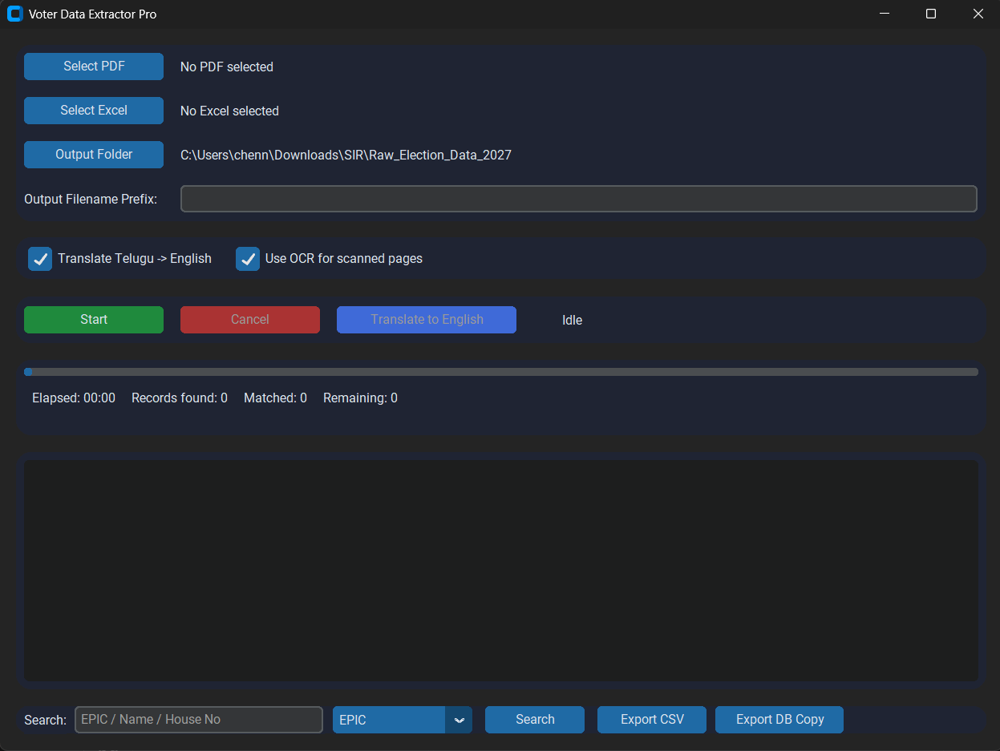
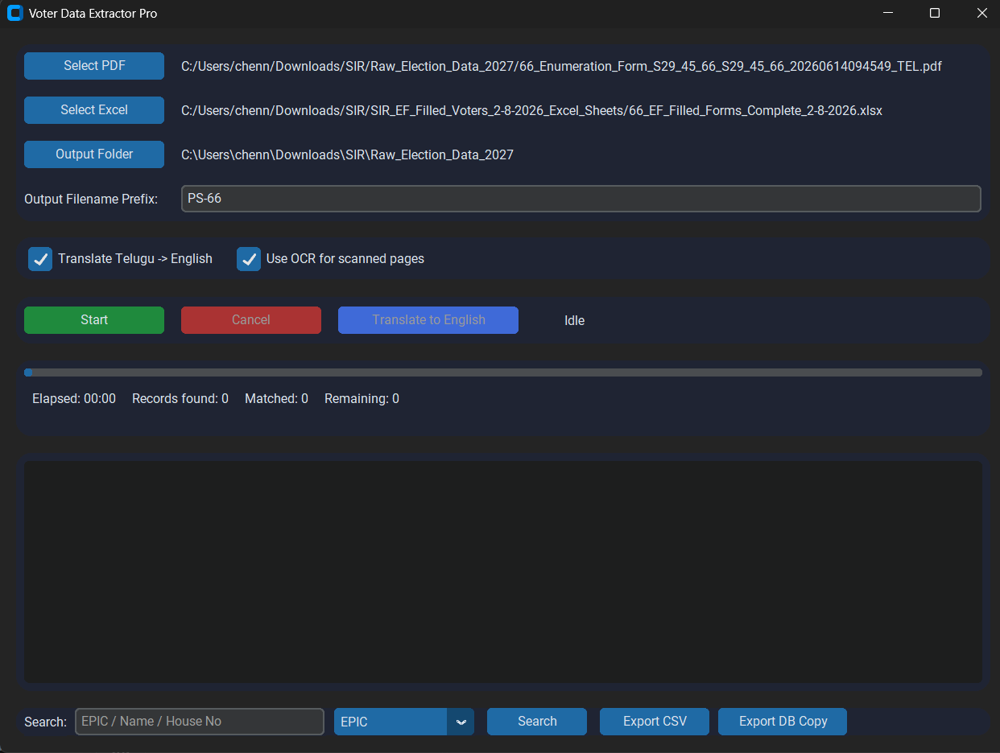
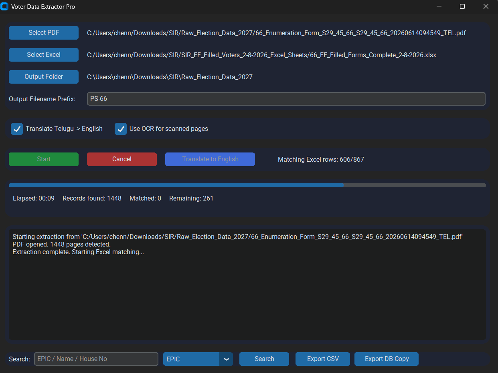
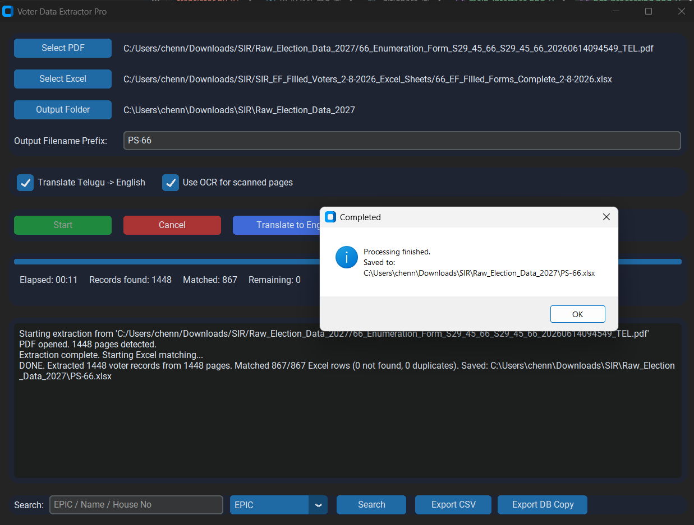

````md
# Voter Data Extractor Pro

A Windows desktop application that extracts voter records from Telangana / Andhra Pradesh Electoral Roll PDFs and fills an Excel template's **House No** and **Colony** columns by matching **EPIC numbers**.

## ✨ Features

- Auto-detects text-based vs. scanned PDF pages; OCRs scanned pages (English + Telugu) with Tesseract.
- Parses each page into individual voter records:
  - EPIC
  - Name
  - Relative Name
  - House No
  - Address / Area
  - Part No
  - Serial No
  - Age
  - Gender
- Stores extracted records in an indexed SQLite database, so the PDF is processed once and later searches can be performed directly from the database.
- Matches every EPIC number in the Excel template against the database.
- Fills **House No** and **Colony** for matched records.
- Writes `NOT FOUND` where no matching EPIC exists.
- Detects and flags duplicate EPIC values.
- Optional Telugu → English **transliteration** of addresses, for example `కొంపల్లి` → `Kompally`.
- Preserves the original Excel template's formatting, colors, and formulas.
- Updates only the required target cells.
- Dark-themed CustomTkinter GUI.
- File selection and drag & drop support.
- Live progress bar and processing status.
- Displays elapsed time, records found, matched records, remaining records, and live logs.
- Uses background threads so the GUI remains responsive during long PDF processing.
- Supports resume-after-interruption.
- Supports CSV and SQLite database export.
- Provides search by EPIC, Name, and House No.

## 🖥️ Application Screenshots

### Main Interface



### PDF Processing



### Excel EPIC Matching



### Search and Results



## ⚙️ Requirements

- Windows
- Python 3.12 or newer
- Tesseract OCR, including English and Telugu language data files when OCR is required
- Poppler, required by `pdf2image` for scanned-page rendering

Text-based PDFs can be processed without OCR. Tesseract and Poppler are required when the electoral roll contains image-only or scanned pages.

## 📦 Installation

### 1. Install Python

Install **Python 3.12 or newer**.

### 2. Install System Dependencies

These dependencies are installed separately and are **not installed through pip**.

#### Tesseract OCR

[Tesseract OCR for Windows](https://github.com/UB-Mannheim/tesseract/wiki)

- Install the English language pack.
- Install the Telugu (`tel`) language pack.
- Add the directory containing `tesseract.exe` to your system `PATH`.

Verify the installation:

```powershell
tesseract --version
````

#### Poppler

Poppler is required for rendering scanned PDF pages.

[Poppler for Windows](https://github.com/oschwartz10612/poppler-windows)

* Extract Poppler.
* Add its `bin` folder to your system `PATH`.

Verify the installation:

```powershell
pdftoppm -h
```

After modifying `PATH`, open a new PowerShell window.

### 3. Install Python Dependencies

From the project directory:

```powershell
python -m pip install -r requirements.txt
```

## ▶️ Running

Start the application with:

```powershell
python main.py
```

### Application Workflow

1. Click **Select PDF** and choose the electoral-roll PDF.
2. Click **Select Excel** and choose your Excel template.
3. Choose an **Output Folder**.
4. Enable or disable **Translate Telugu → English** as required.
5. Enable or disable **Use OCR** as required.
6. Click **Start**.

The application displays processing progress, elapsed time, record counts, and live logs.

When processing is complete, the generated workbook is saved as:

```text
Completed.xlsx
```

in the selected output folder.

## 📊 Excel Template

The Excel template must contain at least the following columns:

* `Epic Number`
* `House No`
* `Colony`

The application supports common variations of these column names.

### EPIC Number

```text
Epic Number
EPIC
EPIC No
```

### House Number

```text
House No
House Number
Flat No
```

### Colony

```text
Colony
Area
Locality
```

The application matches each EPIC against the extracted SQLite database and updates the corresponding **House No** and **Colony** cells.

If an EPIC cannot be found, the application writes:

```text
NOT FOUND
```

Duplicate EPIC values are detected and flagged.

## 💾 Data and Database

Extracted voter records are stored locally in an indexed SQLite database.

This allows later searches and EPIC matching without repeatedly processing the original PDF.

### Supported Searches

* EPIC
* Name
* House Number

### Database Export

The application supports exporting database data to:

* CSV
* Standalone SQLite database

## 🌐 Telugu OCR and Transliteration

The application supports Telugu OCR using Tesseract.

When enabled, Telugu-script addresses can be transliterated into Roman/English script.

Example:

```text
కొంపల్లి
```

can be represented as:

```text
Kompally
```

> Transliteration changes the writing script. It is not a translation service.

## 🔄 Processing Workflow

```text
                    Electoral Roll PDF
                           │
                           ▼
                  PDF Page Detection
                           │
              ┌────────────┴────────────┐
              │                         │
              ▼                         ▼
       Text-based Page             Scanned Page
              │                         │
              │                         ▼
              │                  Tesseract OCR
              │                  English/Telugu
              │                         │
              └────────────┬────────────┘
                           ▼
                    Record Extraction
                           │
                           ▼
                    SQLite Database
                           │
                 ┌─────────┴─────────┐
                 │                   │
                 ▼                   ▼
              Search            EPIC Matching
                                      │
                                      ▼
                               Excel Template
                                      │
                                      ▼
                                Completed.xlsx
```

## 🔄 Resume and Recovery

If extraction is cancelled or interrupted due to a crash, cancellation, or power loss, the application stores the last completed PDF page.

When the same PDF is opened again, the application can offer to resume from the saved page instead of reprocessing the entire document.

Users can also choose to start a new run from the beginning.

## 📁 Project Layout

```text
VoterDataExtractor/

├── main.py              # Application entry point
├── gui.py               # CustomTkinter GUI + threading
├── extractor.py         # PDF parsing (text + OCR) into VoterRecords
├── ocr.py               # Tesseract OCR fallback for scanned pages
├── database.py          # SQLite schema, batch insert, search, export
├── matcher.py           # EPIC matching logic against the database
├── excel_writer.py      # openpyxl read/write, preserves formatting
├── translator.py        # Telugu -> English transliteration
├── utils.py             # Logging, resume state, stopwatch
├── config.py            # Paths, regexes, constants
├── requirements.txt     # Python dependencies
├── README.md            # Project documentation
├── LICENSE              # MIT License
│
├── screenshots/         # Application screenshots
├── logs/                # Local processing.log (ignored)
├── output/              # Local Completed.xlsx / exports (ignored)
└── database/            # Local voters.db + resume state (ignored)
```

## 🔧 Adjusting to Your PDF's Exact Layout

Electoral-roll PDF layouts can vary slightly by year and by the CEO office template used.

The field-extraction regular expressions are located in:

```text
extractor.py
```

Examples include:

```text
_LABEL_NAME
_LABEL_RELATIVE
_LABEL_HOUSE
```

The EPIC number pattern is located in:

```text
config.py
```

as:

```text
EPIC_PATTERN
```

If your PDFs use different field labels or an EPIC format outside the expected pattern, adjust those expressions.

The rest of the pipeline — database, matching, Excel writing, and GUI — is layout-agnostic and does not require changes.

## ⚡ Performance

The application is designed for large electoral-roll datasets through:

* Page-by-page PDF processing
* Automatic OCR fallback
* SQLite batch insertion
* Indexed database searches
* Avoiding repeated PDF processing
* Background processing
* Resume support

## ⚠️ Notes and Limitations

* This tool only works with **unencrypted** PDFs. Password-protected files must be unlocked before processing.
* OCR accuracy on scanned electoral rolls depends heavily on scan quality, resolution, orientation, and language data.
* Review the local `logs/processing.log` file for pages that produced no records.
* Duplicate EPIC values are detected and flagged.
* Transliteration changes the writing script; it is not translation.
* Always verify a sample of matched rows in `Completed.xlsx` against the source PDF before relying on the output for official use.

## 🔐 Data Privacy

Input PDFs, Excel templates, generated workbooks, CSV exports, SQLite databases, resume state, and processing logs may contain personal voter data.

Keep these files local and do not commit or publish them.

The repository `.gitignore` excludes generated files in:

```text
database/
logs/
output/
```

as well as common voter-data formats.

Always review:

```bash
git status
```

before pushing changes.

## 📜 License

This project is licensed under the **MIT License**.

See the [LICENSE](LICENSE) file for details.

## Author

**Chennuru Rohit Reddy**

Software Developer | AI & Cloud Technologies

GitHub: [Rohitreddy06](https://github.com/Rohitreddy06)

## Repository

[Voter Data Extractor Pro](https://github.com/Rohitreddy06/voter-data-extractor-pro)

```
```
